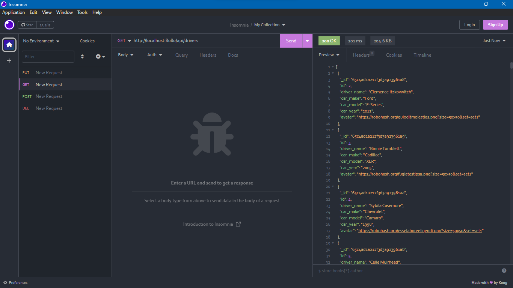

##This is a RESTFUL nodeJS API.

If you have an API client like Insomnia, PostMan, ThunderClient, or any other, this will work well for you.

Go inside the mock-data folder to access the dummy data. The data has been generated using [mockaroo.com](https://www.mockaroo.com/)

I have not included a frontEnd or any templating engine templates.

## Here are the environment variables that you will need.

```bash
MONGO_URL = 
PORT= 
```

#Have Fun!
